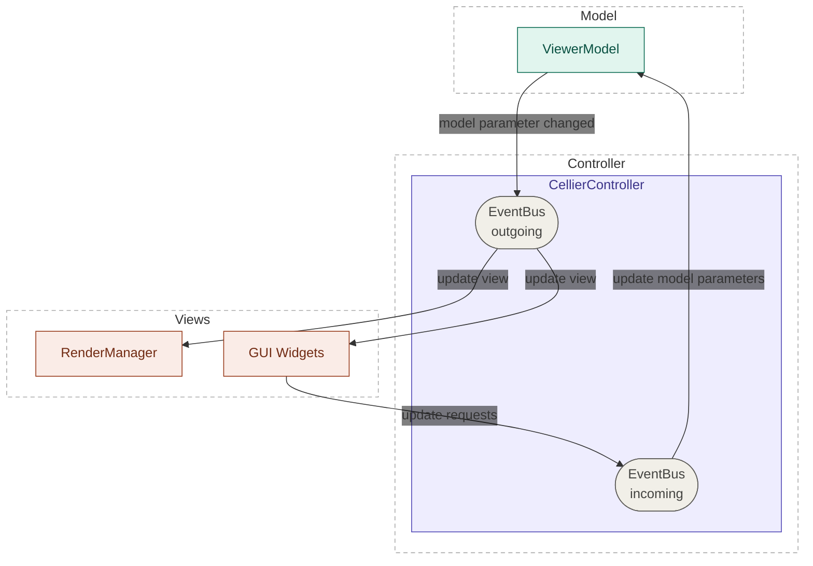

# Cellier architecture

## Summary
This document provides a high level description of the architecture of the Cellier library. The goal it so clarify the responsibilities of the different components of the Cellier and explain how they are connected. There are links to separate documents that describe the components in more detail.

## Design principles of Cellier

The architecture of Cellier was designed to make Cellier a versatile library of components that can be easily composed to create performant viewers of multiscale scientific data. Rather than a monolithic viewer that serves many purposes, we want to make it easy for you to create custom viewers tailored to your needs. To this end, we have designed Cellier with the following principles in mind:

- clean separation between the model and the view
- a round trip of the viewer state should be fully reproduce a visualization
- prefer interfaces over component abstractions
- work equally well in an interactive scripting environment and a standalone application.

The Cellier library uses a [model-view-controller ](https://en.wikipedia.org/wiki/Model%E2%80%93view%E2%80%93controller) architecture. The viewer state is encapsulated in the model. The visualizations of the viewer state are encapsulated in the view. These visualizations include both the graphical user interface elements to update parameters (e.g., a slider to change the contrast limits) and the rendered scene on the canvas. The controller coordinates between the model and view. There is bidirectional synchronization between the model and view. That means that changes to the model update the view and changes to the view update the model. 

### Clean separation between the model and the view
We aim to have a clean separation between the model (i.e., viewer state) and the view (i.e., GUI and canvas). This separation of concerns provides the flexibility to swap out different rendering and GUI backends. It also means that the viewer state should be fully encapsulated in the model. This makes it easier for developers and users to know how to access and modify the state of the viewer.

### A round trip of the viewer state should be fully reproduce a visualization

The viewer state should be fully serializable and deserializable such that a visualization of a dataset can be fully reproduced. This means that state stored in the viewer model is sufficient to reproduce a given view of the data. In the future, we hope the serialized Cellier ViewerModel can be used to make interoperable views between different viewers (e.g., translate the serialized state).

### Prefer view interfaces over component abstractions

In order to facilitate multiple backends (e.g., renderers), we define interfaces for the view layers. We do not aim to have an abstraction for each component in the layer. For example, for the rendering backend, we define an interface for the RenderManager, which has the API the controller needs to set up the visualization. We do not define base classes for the underlying components (e.g., visuals or buffers). The reason is that defining abstractions at the component level that work across multiple backends often necessitates using the “lowest common denominator”. By making the interface at the layer level, each backend implementation can be architected in a way that makes the most of the features of that backend.

## The ViewerModel stores the viewer state

The ViewerModel stores the state for the all current visualizations in the viewer. This includes all canvases, scenes, and visuals. The ViewerModel is a [psygnal EventedModel](https://psygnal.readthedocs.io/en/latest/reference/psygnal/#psygnal.EventedModel), which is a Pydantic BaseModel that emits psygnal events when a property changes. We use Pydantic to validate parameters and serialize/deserialize the state. The Psygnal events are used to synchronize changes to the model to the views.

## The view

In Cellier, there are two views on the data:

- controls: these are graphical user interface components that are used to set parameters on the ViewerModel (e.g., the contrast limits for an image). Cellier currently supports Qt6/Pyside6 widgets, but is designed to allow for other control backends.
- rendered scenes: these are the visualizations rendered to a canvas. The rendered scenes components are encapsulated in the RenderManager. Currently, pygfx is the only RenderManager backend, Cellier is being designed such that others are possible.

## The CellierController coordinates between the model and view

The CellierController coordinates between the model and views and serves as the primary public API for the user. The CellierController utilizes Psygnal events to synchronize the model and views. The events and callbacks are managed by EventBus objects. There is a separate EventBus for ingoing (i.e., model to view) and outgoing (i.e., view to models) signals.

