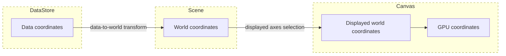
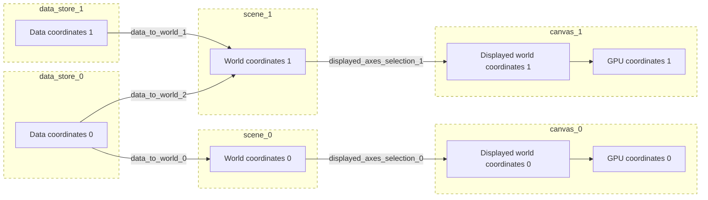

# Coordinate systems

## Overview
This document explains the different coordinate systems used in Cellier. There are 4 types of coordinate systems in Cellier:

- **Data coordinates**: these are the m-dimensional coordinate systems that the raw data are expressed in. For example, in an image array, these would be the array indices. There is one data coordinate system per DataStore.
- **World coordinates**: these are the n-dimensional coordinate systems that all datasets in a given scene are aligned in. There is one world coordinate system per scene.
- **Displayed world coordinates**: this is the subset of the world coordinate being rendered in a given scene. For example, if a world coordinate system is `TCZYX` and the ``(0, 2, 4)`` axes are being rendered, the displayed world coordinate system is `TZX`.
- **GPU coordinates**: this is the coordinate system of the textures and vertices on the GPU.

The data coordinates are mapped to the world coordinates via the data-to-world transform. The world coordinates are mapped to the displayed world coordinates by the displayed axes selection.

## Multiple data stores and scenes

Cellier is designed for flexible configuration of DataStores, scenes, and canvases.

- a DataStore can provide data to multiple scenes
- a viewer can have multiple scenes
- a scene can be rendered to multiple canvases

## Pixel/voxel alignment

In order to align the images with the other visuals (e.g., points or meshes), the center of the origin voxel is aligned with the origin `(0, 0)`, in world space. For example, in 2D, when the world-to-data transform is the identity, the center of voxel (0, 0) is aligned with point (0, 0) in world space.

## Pygfx GPU coordinates

!!! note
	This is an implementation detail for the Pygfx backend and is likely not relevant to most Cellier users.

In Pygfx, textures and buffers get read differently. Textures get read row-wise whereas buffers get read column-wise. Cellier in-memory and multiscale image visuals use textures to store the voxel values whereas the points, lines, and meshes use a buffer to store the coordinates. Thus, the coordinates in the first and last axis get swapped before they are uploaded to the GPU for the points, lines, and mesh visuals. Note that this is the coordinates being uploaded to the GPU and thus it means the displayed world coordinates. For example, in a `TCZYX` image where `TYX` are being rendered, the coordinates would be uploaded to the GPU as `XYT`.