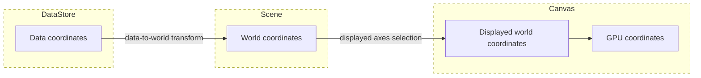
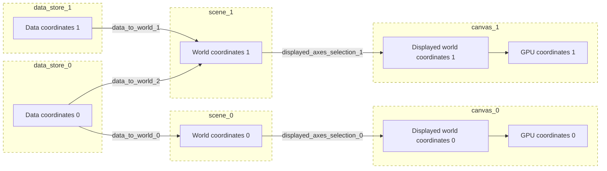

# Coordinate systems

## Overview
This document explains the different coordinate systems used in Cellier. There are 4 types of coordinate systems in Cellier:

- **Data coordinates**: these are the m-dimensional coordinate systems that the raw data are expressed in. For example, in an image array, these would be the array indices. There is one data coordinate system per DataStore.
- **World coordinates**: these are the n-dimensional coordinate systems that all datasets in a given scene are aligned in. There is one world coordinate system per scene.
- **Displayed world coordinates**: this is the subset of the world coordinate being rendered in a given scene. For example, if a world coordinate system is `TCZYX` and the ``(0, 2, 4)`` axes are being rendered, the displayed world coordinate system is `TZX`.
- **GPU coordinates**: this is the coordinate system of the textures and vertices on the GPU.

The data coordinates are mapped to the world coordinates via the data-to-world transform. The world coordinates are mapped to the displayed world coordinates by the displayed axes selection.

```mermaid
flowchart LR
    subgraph DataStore["DataStore"]
        direction LR
        DC["Data coordinates"]
    end

    subgraph Scene["Scene"]
        direction LR
        WC["World coordinates"]
    end

    subgraph Canvas["Canvas"]
        direction LR
        DWC["Displayed world coordinates"] --> GPU["GPU coordinates"]
    end

    DC -->|"data-to-world transform"| WC
    WC -->|"displayed axes selection"| DWC

    style DataStore stroke-dasharray: 5 5
    style Scene stroke-dasharray: 5 5
    style Canvas stroke-dasharray: 5 5
```

## Multiple data stores and scenes

Cellier is designed for flexible configuration of DataStores, scenes, and canvases.

- a DataStore can provide data to multiple scenes
- a viewer can have multiple scenes
- a scene can be rendered to multiple canvases

```mermaid
flowchart LR
    subgraph DS0["data_store_0"]
        DC0["Data coordinates 0"]
    end

    subgraph DS1["data_store_1"]
        DC1["Data coordinates 1"]
    end

    subgraph S0["scene_0"]
        WC0["World coordinates 0"]
    end

    subgraph S1["scene_1"]
        WC1["World coordinates 1"]
    end

    subgraph C0["canvas_0"]
        DWC0["Displayed world coordinates 0"] --> GPU0["GPU coordinates 0"]
    end

    subgraph C1["canvas_1"]
        DWC1["Displayed world coordinates 1"] --> GPU1["GPU coordinates 1"]
    end

    DC0 -->|"data_to_world_0"| WC0
    DC1 -->|"data_to_world_1"| WC1
    DC0 -->|"data_to_world_2"| WC1
    WC0 -->|"displayed_axes_selection_0"| DWC0
    WC1 -->|"displayed_axes_selection_1"| DWC1

    style DS0 stroke-dasharray: 5 5
    style DS1 stroke-dasharray: 5 5
    style S0 stroke-dasharray: 5 5
    style S1 stroke-dasharray: 5 5
    style C0 stroke-dasharray: 5 5
    style C1 stroke-dasharray: 5 5
```

## Pixel/voxel alignment

In order to align the images with the other visuals (e.g., points or meshes), the center of the origin voxel is aligned with the origin `(0, 0)`, in world space. For example, in 2D, when the world-to-data transform is the identity, the center of voxel (0, 0) is aligned with point (0, 0) in world space.

## Multiscale level placement

A multiscale (pyramid) DataStore has one more transform per resolution level:
the **level-to-data** transform (`DataStore.level_transforms`), which maps a
coarser level's voxel coordinates onto the finest level's (level 0). Level 0's
is the identity; the data-to-world transform then takes level 0 to the world.
The readers build these from the OME-Zarr `coordinateTransformations` of each
dataset: per axis, the scale `s_k` and translation `t_k` relative to level 0,
in level-0 voxels.

Every level is placed with the same convention as the pixel/voxel alignment
above, **voxel centres**:

- data coordinate `p`: level-0 voxel `i` is centred on `p = i` and covers
  `[i - 0.5, i + 0.5]`;
- level coordinate `u`: level-k voxel `i` is centred on `u = i`.

| Quantity | Definition |
|---|---|
| level to data | `p = s_k * u + t_k` |
| data to level | `u = (p - t_k) / s_k` |
| level-k voxel `i` | `u` in `[i - 0.5, i + 0.5]` |
| nearest sample (labels) | voxel `floor(u + 0.5)` |
| linear sample (images) | texel coordinate `u + 0.5` |

So the translation says where each coarse voxel sits: for a pyramid made by
averaging `2 x 2` blocks, coarse voxel 0 is centred between level-0 voxels 0
and 1, so its metadata should say `t = 0.5`; for one made by taking every
second voxel (`[::2]`), `t = 0`. Cellier draws every level where its metadata
says, in 2D and 3D, so a dataset whose metadata omits the translations of an
averaged pyramid shifts by `(s - 1) / 2` level-0 voxels at coarse levels.

**What Cellier supports.** A coarse level must be an axis-aligned scale of
level 0 (scale >= 1, not decreasing with level), offset by less than one of
its own voxels (`-0.5 <= t_k <= s_k - 0.5`), and cover level 0's extent to
within one of its own voxels. That accepts block averaging, plain striding
and offset striding, including non-integer ratios. A store outside this
contract (for example a cropped coarse level) raises a `ValueError` when it
gets its transforms or is added to a scene; see
`cellier.data._level_contract`. The mapping itself lives in
`cellier.render._level_mapping`, and how the renderer uses it is in
[Multiscale brick lookup](multiscale_brick_lookup.md#level-placement).

## Pygfx GPU coordinates

!!! note
	This is an implementation detail for the Pygfx backend and is likely not relevant to most Cellier users.

In Pygfx, textures and buffers get read differently. Textures get read row-wise whereas buffers get read column-wise. Cellier in-memory and multiscale image visuals use textures to store the voxel values whereas the points, lines, and meshes use a buffer to store the coordinates. Thus, the coordinates in the first and last axis get swapped before they are uploaded to the GPU for the points, lines, and mesh visuals. Note that this is the coordinates being uploaded to the GPU and thus it means the displayed world coordinates. For example, in a `TCZYX` image where `TYX` are being rendered, the coordinates would be uploaded to the GPU as `XYT`.