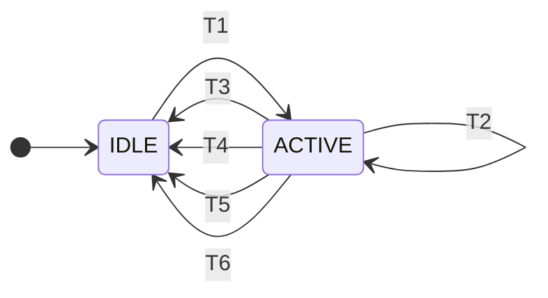

# Interaction tracker

Cellier needs to tell two things apart:

- an **interaction**: the user is scrubbing a dims slider, or moving the camera. Many small changes arrive in a row, and loading full-resolution data for each one would waste work on views the user has already left.
- a **jump**: a script moved the dims or the camera once. The new view should load in full, at once.

The interaction tracker makes that state explicit. There is one mechanism, used twice: for the dims (a *scrub*) and for the camera (a *motion*). This page explains the mechanism, how each of the two uses it, and how an application can listen to it.

For how the tracker feeds into loading (plan modes, the backstop, the reslice paths), see [Slicing](slicing.md).

## The tracker

`InteractionTracker` (`cellier/_interaction.py`) is a small, pure state machine. It has two states, `IDLE` and `ACTIVE`, and knows nothing about dims, cameras or asyncio. It is driven by two kinds of input.

**Ticks.** A tick is one change of the tracked input: a slice position moved, or the camera moved. A tick is **interactive** when the caller marks it so, or when a scope is open. Otherwise it is a **jump**.

**Scopes.** A scope says "something is holding the input": a slider is pressed, the camera controller is driving the camera, or a script is inside a `with` block. Scopes are counted per source id. Opening a scope starts nothing by itself; the first tick does.



| Transition | From, to | Caused by | Event emitted | Stillness timer |
|---|---|---|---|---|
| T1 | `IDLE` to `ACTIVE` | An interactive tick | start | started |
| T2 | `ACTIVE` to `ACTIVE` | An interactive tick | none | restarted |
| T3 | `ACTIVE` to `IDLE` | The last open scope closes | end, `"release"` | stopped |
| T4 | `ACTIVE` to `IDLE` | The stillness time passes with no tick | end, `"settle"` | ran out |
| T5 | `ACTIVE` to `IDLE` | A jump (a tick that is not interactive) | end, `"jump"` | stopped |
| T6 | `ACTIVE` to `IDLE` | The view is replaced | end, `"cancel"` | stopped |

"Event emitted" is the interaction event: `DimsInteractionEvent` for the dims, `CameraInteractionEvent` for the camera. T2 emits no interaction event, but each tick still emits its own change event (`DimsChangedEvent` or `CameraChangedEvent`).

Three inputs cause no transition at all, in either state:

- opening a scope;
- closing a scope while `IDLE`, or closing one while another source's scope is still open;
- a jump while `IDLE`.

An interaction ends in one of four ways (T3 to T6), and the end event says which:

| Reason | What happened | What loads |
|---|---|---|
| `"release"` | The last open scope closed: the slider was released, the camera controller stopped driving the camera, or a `with` block exited. | The full view, at once. |
| `"settle"` | No tick arrived for the stillness time. This is how an interaction with no scope ends (a keyboard step, a wheel step on a slider), and how one ends while the input is held still. | The full view. |
| `"jump"` | A tick that was not interactive arrived during the interaction (a script moved the input while the user was dragging). | The jump's own full load covers it. |
| `"cancel"` | The view the interaction belonged to was replaced: the displayed axes changed, or the canvas switched between 2D and 3D. | The change that caused it loads the new view. |

Three rules follow from the table and are worth stating on their own:

- **Release or stillness, whichever comes first.** Holding a slider or a drag still for the stillness time ends the interaction even though the button is down. The scope stays open, so the next movement starts a new interaction.
- **A change that changes nothing is not a tick.** Setting a position to the value it already has, moving the stored position of a *displayed* axis, or fitting a camera that is already fitted does nothing.
- **A scope with no tick emits nothing.** A click that does not move the camera, or a slider pressed and released in place, opens and closes a scope silently.

### Worked examples

Each example lists what the user does, the transition it causes (from the table above), and the state afterwards. They hold for both uses of the tracker. For a slider, "press" and "release" are the mouse button on the handle. For the camera, the scope belongs to the camera controller: it opens when the button goes down and closes when the camera has stopped, which is after the glide that follows the button coming up.

**The user clicks, drags, and releases.**

1. Press. The scope opens. No transition; the state is `IDLE`.
2. First move. An interactive tick: **T1**. The start event is emitted and the stillness timer starts. The state is `ACTIVE`.
3. Each further move. An interactive tick: **T2**. The timer restarts. The state stays `ACTIVE`.
4. Release. The last scope closes: **T3**. The end event is emitted with `"release"`. The state is `IDLE`.

One start event and one end event.

**The user clicks, does not drag, and releases.**

1. Press. The scope opens. No transition; the state is `IDLE`.
2. Release. The scope closes. No transition, because there is no interaction to end; the state is `IDLE`.

No events, and nothing is resliced.

**The user clicks, drags, pauses, drags again, and releases.**

1. Press. The scope opens. No transition; the state is `IDLE`.
2. First move. An interactive tick: **T1**. The start event is emitted. The state is `ACTIVE`.
3. Each further move. **T2**. The state stays `ACTIVE`.
4. Pause, button still down. No tick arrives for the stillness time: **T4**. The end event is emitted with `"settle"`, and the view loads in full. The scope is still open. The state is `IDLE`.
5. First move after the pause. The tick is interactive because the scope is open: **T1**. A second start event is emitted. The state is `ACTIVE`.
6. Each further move. **T2**. The state stays `ACTIVE`.
7. Release. The last scope closes: **T3**. The end event is emitted with `"release"`. The state is `IDLE`.

Two interactions: start, end `"settle"`, start, end `"release"`. A pause shorter than the stillness time causes no transition, and the whole drag is one interaction as in the first example.

### The driver

The tracker decides; something else has to keep time. `_InteractionDriver` (`cellier/_interaction_driver.py`) owns the trackers of one kind and their timers. The controller has two drivers:

| Driver | One tracker per | Stillness time |
|---|---|---|
| `CellierController._dims_driver` | scene | `SchedulerConfig.dims_settle_s` (0.15 s) |
| `CellierController._camera_driver` | canvas | `CameraConfig.settle_threshold_s` (0.3 s) |

Dims are tracked per scene because every canvas of a scene shows the same slice. The camera is tracked per canvas because each canvas has its own camera: moving one must not affect another.

A driver keeps one `asyncio` task per `ACTIVE` tracker. The task sleeps until the tracker's deadline; a tick only moves the deadline, and the task re-reads it when it wakes. When a tracker leaves `ACTIVE` by release, jump or cancel, its task is cancelled, so no timer outlives its interaction. With no running event loop (a synchronous script or test) there is no timer, and an interactive tick ends at once with `"settle"`.

Every transition goes to one callback per kind, `_on_dims_transition` and `_on_camera_transition`, which emits the event and does the reslicing described below.

## Dims: a scrub

### What ticks and what holds a scope

| Input | Tick | Scope |
|---|---|---|
| Slider drag (Qt and anywidget) | interactive | open from press to release |
| Slider keyboard or wheel step, groove click | interactive | none on most toolkits, so it ends on stillness |
| `controller.update_slice_indices(scene_id, positions)` | jump | - |
| `controller.update_slice_indices(..., interactive=True)` | interactive | none |
| Any move inside `with controller.dims_interaction(scene_id):` | interactive | the `with` block |
| A thickness change | jump (a tick if a scope is open) | - |
| A displayed-axes change | cancels a scrub | - |

Only a **sliced** axis ticks. A scene keeps a position for every world axis, displayed or not, but a displayed axis is not sliced, so moving its stored position does not change what the scene shows.

### What a scrub does

Visuals do not subscribe to the tracker. Each visual model answers one question through its own explicit config, `BaseVisual.plans_coarse_on_scrub`:

| Visual | `plans_coarse_on_scrub` |
|---|---|
| Multiscale image, multiscale labels | `render_config.loading.dims_drag == "backstop"` (the default is `"eager"`, which is `False`) |
| Multiscale mesh | `lod.dims_drag == "coarse"` (the default, which is `True`), when the mesh has more than one level |
| Everything else | `False` |

The controller turns the tracker's state into a plan mode in one place, `CellierController._render_config_for`:

- While the scene's tracker is `ACTIVE`, a visual that opted in plans `BACKSTOP_ONLY` (its coarse backstop level) and joins the scene's *pending set*. This applies to **every** reslice during the scrub, not only the scrub's own ticks: a visual shown, a config change, a store change, and a camera reslice all plan coarse.
- Visuals that did not opt in plan in full on every tick, as they always have.
- When the scrub ends by release or stillness, the pending set is planned in full, once.

### Timeline: a slider drag

Time runs left to right. The slider is dragged across three positions and released.

```text
time ───────────────────────────────────────────────────────────────────────►

input                   press    move     move     move     release
slider scope            [ open ──────────────────────────── ] closed
tracker state    IDLE            [ ACTIVE ───────────────── ] IDLE

DimsInteractionEvent             start                        end, "release"
DimsChangedEvent                 tick     tick     tick     tick
  (interactive=True)                                        (the flushed
                                                             final position)

loading, opted-in                coarse   coarse   coarse   coarse, then full
loading, other visuals           full     full     full     full
```

Step by step:

1. **Press.** The slider emits `DimsInteractionUpdateEvent("begin")`; the controller opens the slider's scope on the scene's tracker. Nothing is emitted: a scope starts nothing.
2. **First move.** The slider submits a `DimsUpdateEvent` with `interactive=True`. `update_slice_indices` ticks the tracker **before** writing the positions, so `DimsInteractionEvent(phase="start")` reaches its listeners while the dims model still holds the old position. Then the position is written, `DimsChangedEvent(interactive=True)` goes out, and the scene reslices: coarse for the visuals that opted in.
3. **Further moves.** Each is a tick. It moves the stillness deadline, emits `DimsChangedEvent(interactive=True)`, and reslices coarse. Sliders throttle their ticks to one every 50 ms.
4. **Release.** The slider first flushes its throttle, submitting the final position if it was still waiting, and only then emits `DimsInteractionUpdateEvent("end")`. The scope closes, the tracker ends with `"release"`, `DimsInteractionEvent(phase="end", reason="release")` goes out, and the pending set is planned in full, for the final position.

On some toolkits the press arrives *after* the first move (a groove click moves the value first). Nothing depends on the order: slider ticks are interactive with or without a scope.

If the user stops moving but keeps the button down, the timer ends the scrub with `"settle"` after 0.15 s and the full plan runs then. The scope stays open; the next move starts a new scrub.

### The anywidget slider

In a notebook, the press and release are custom messages from the browser: `{"type": "interaction", "phase": "begin"}` and `{"type": "interaction", "phase": "end", "slice_indices": {...}}`. The end message **carries the final position**, and Python applies it before closing the scope. It cannot rely on the position's own traitlet sync, sent just before: a custom message can overtake a traitlet sync (in Jupyter when the kernel is busy, in marimo always), and the scrub would then end on a position the slider has already left.

### The ortho viewer

`OrthoDimsController` keeps the four panels' positions equal by writing them with plain `update_slice_indices` calls, which by themselves are jumps. So it also forwards the scrub: when a scrub starts on one panel it opens a scope on every other panel, and closes them when that scrub ends. Because the start event is emitted before the positions change, the scopes are open by the time the mirrored ticks arrive, and those ticks are scrub ticks.

A panel that *displays* the scrubbed axis receives no tick: its region does not change. Dragging `z` in the `xy` panel therefore scrubs only `xy`; dragging an axis that every panel slices (`t`) scrubs all four.

## Camera: a motion

### What ticks and what holds a scope

Camera ticks come from **frames**, not from input events. `CanvasView` drives its pygfx camera controller itself: each frame, in `_draw_frame`, it

1. ticks the controller, which returns the new camera state while it has a running action (a drag held, the damped glide after a drag, a wheel or key animation) and `None` otherwise;
2. applies that state to the camera;
3. compares the camera with the last state it reported. A difference emits `CameraChangedEvent(interactive=True)` and resets temporal accumulation, in the frame that draws the new camera;
4. compares "the controller has a running action" with the previous frame, and reports a change as the internal `_CameraControllerEvent`.

| Input | Tick | Scope |
|---|---|---|
| A camera change seen between frames | interactive | - |
| The camera controller has a running action | - | open for as long as it does |
| `fit_camera`, `look_at_visual`, `set_camera_depth_range`, `set_camera_state` | jump | - |
| Any of those with `interactive=True` | interactive | none |
| Any move inside `with controller.camera_interaction(canvas_id):` | interactive | the `with` block |
| The canvas switches between 2D and 3D | cancels a motion | - |

The controller's scope is what "release" means for the camera: **the controller stopped driving the camera**, which is when the button is up *and* the damped glide has finished. It is not `pointer_up`, which comes while the camera is still moving.

### What a motion does

- **While active, nothing is resliced.** A reslice per frame is not wanted. The canvas's `CanvasView.camera_moving` flag is `True`, for visuals that choose what to draw per frame. A multiscale mesh reads it: in a 3D view it draws its coarse level on the canvas whose camera is moving, and its finest level in the frame after the motion ends (`lod.camera_motion`; see [A mesh with levels of detail](slicing.md#a-mesh-with-levels-of-detail)).
- **At the end** (release or stillness), the scene's visuals with `requires_camera_reslice` plan in full. Today those are the multiscale image and labels, which choose their level of detail and the bricks to load from the camera. The end reslices the whole scene, one request per canvas, because chunk residency is per visual.
- **A jump** reslices those visuals at once.
- `controller.camera_reslice_enabled = False` keeps the tracker and its events and skips the reslices.

A motion's end is detected inside a draw, where planning must not run. The flag and the event are set at once; the reslice is queued as a task on the event loop.

### Timeline: an orbit drag

One column per drawn frame. The button goes down, the pointer moves for three frames, the button goes up, and the camera glides for two more frames before it stops.

```text
frame                  1       2       3       4       5       6       7
input                  down    move    move    move    up
camera moved           no      yes     yes     yes     yes     yes     no
                                                       (glide) (glide) (stopped)

controller scope       [ open ──────────────────────────────── ] closed
tracker state    IDLE          [ ACTIVE ────────────────────── ] IDLE

CameraChangedEvent             tick    tick    tick    tick    tick
  (interactive=True)
CameraInteractionEvent         start                                   end, "release"

camera_moving          False   True    True    True    True    True    False
reslice                -       -       -       -       -       -       queued; runs
                                                                       after frame 7
```

Step by step:

1. **Frame 1, button down.** The controller has an action, so the canvas reports that it is driving and the controller's scope opens. The camera has not moved, so there is no tick and no event.
2. **Frame 2, first move.** The camera changed. `CameraChangedEvent(interactive=True)` goes out in the frame that draws the new camera; the tracker starts; `CameraInteractionEvent(phase="start")` goes out and `camera_moving` becomes `True`.
3. **Frames 3 to 6.** Each moved frame emits `CameraChangedEvent` and moves the stillness deadline. The button goes up in frame 5, and nothing happens: the controller is still gliding.
4. **Frame 7, the camera has stopped.** The controller has no action left, so the canvas reports that it stopped driving and the scope closes. The tracker ends with `"release"`: `CameraInteractionEvent(phase="end", reason="release")` goes out, `camera_moving` becomes `False`, and the reslice is queued. It runs from the event loop right after this draw.

Each wheel notch is a short animation of its own (about 0.4 s). Notches closer together than that are one motion; a pause longer than that ends the motion and the next notch starts another, so a slow wheel zoom reslices between notches.

A click that does not move the camera opens and closes the controller's scope with no tick: nothing is emitted. A drag held still for 0.3 s ends with `"settle"`; the scope stays open, and the next move starts a new motion.

## Dims and camera together

The two trackers are independent, with two rules for when they overlap:

- **A camera reslice during a scrub plans coarse.** The plan mode comes from the scene's dims tracker whatever caused the reslice, so a camera motion that ends while a slider is being dragged does not load full resolution for a slice the slider is leaving.
- **A scrub that ends during a camera motion leaves the camera-sensitive visuals to the camera's end.** Planning them in full from a camera that is still moving would issue reads for a view the camera's end is about to replace. They keep their backstop until then.

## Listening from an application

Both trackers announce their transitions on the event bus. An application subscribes through the controller:

| | Dims | Camera |
|---|---|---|
| Start and end | `DimsInteractionEvent` | `CameraInteractionEvent` |
| Subscribe | `controller.on_dims_interaction(scene_id, callback, owner_id=...)` | `controller.on_camera_interaction(scene_id, callback, owner_id=...)` |
| Per tick | `DimsChangedEvent.interactive` | `CameraChangedEvent.interactive` |
| Current state | `controller.dims_interaction_state(scene_id)` | `controller.camera_interaction_state(canvas_id)` |

Both events carry `phase` (`"start"` or `"end"`) and `reason` (`None` for a start). `DimsInteractionEvent` also carries `axes`, the world axes the scrub moved. `CameraInteractionEvent` also carries `canvas_id`: it is routed by scene, so one subscription hears every canvas of the scene. No event is emitted per tick; the `interactive` flag on the ordinary changed events carries that.

The start of a scrub is emitted **before** the first tick changes the dims model, so a listener can react ahead of the tick's consequences.

### Example: print the events

This script builds a small viewer, subscribes one callback to each tracker, and then drives both from code so it runs without a window. In a GUI the same callbacks fire for a slider drag and a camera drag.

```python
import asyncio
from uuid import uuid4

import numpy as np

from cellier.convenience import Viewer
from cellier.data.image._image_memory_store import ImageMemoryStore
from cellier.events import CameraInteractionEvent, DimsInteractionEvent
from cellier.scene.dims import spatial_axes


async def main() -> None:
    viewer = Viewer(spatial_axes("z", "y", "x"), dim="2d", gui="offscreen")
    viewer.add_image(ImageMemoryStore(data=np.zeros((32, 32, 32), dtype=np.float32)))
    viewer.add_canvas()
    controller = viewer.controller
    scene_id = viewer.scene.id
    my_id = uuid4()  # owns the subscriptions, for teardown

    def on_dims_interaction(event: DimsInteractionEvent) -> None:
        print(f"dims   {event.phase:5s} reason={event.reason} axes={sorted(event.axes)}")

    def on_camera_interaction(event: CameraInteractionEvent) -> None:
        print(f"camera {event.phase:5s} reason={event.reason}")

    controller.on_dims_interaction(scene_id, on_dims_interaction, owner_id=my_id)
    controller.on_camera_interaction(scene_id, on_camera_interaction, owner_id=my_id)

    # A scrub that ends on release: every move inside the block is a tick.
    with viewer.dims_interaction():
        for z in (4.0, 5.0, 6.0):
            viewer.set_slice_positions({0: z})

    # A scrub that ends on stillness: an interactive tick with no scope.
    viewer.set_slice_positions({0: 7.0}, interactive=True)
    await asyncio.sleep(0.3)  # longer than dims_settle_s (0.15 s)

    # A jump: not an interaction, so nothing is printed.
    viewer.set_slice_positions({0: 8.0})

    # A camera motion that ends on release.
    state = viewer.get_camera_state()
    with viewer.camera_interaction():
        for zoom in (1.5, 2.0, 2.5):
            viewer.set_camera_state(state._replace(zoom=zoom))

    # A camera jump: nothing is printed.
    viewer.fit_camera()

    controller.unsubscribe_owner(my_id)
    controller.close()


asyncio.run(main())
```

It prints:

```text
dims   start reason=None axes=[0]
dims   end   reason=release axes=[0]
dims   start reason=None axes=[0]
dims   end   reason=settle axes=[0]
camera start reason=None
camera end   reason=release
```

Things to notice:

- Three moves inside `dims_interaction` produce one start and one end, not three of each.
- The interactive move with no scope ends by itself, 0.15 s later, with `"settle"`. It needs a running event loop for its timer, which is why the example is `async`.
- The plain `set_slice_positions` and `fit_camera` calls are jumps and print nothing.

### Scripts that move the dims or the camera repeatedly

The same `with` blocks are how a player or a fly-through tells cellier it is an interaction: it loads coarse (dims) or does not reslice (camera) while it runs, and loads in full once when the block exits.

```python
with controller.dims_interaction(scene_id):
    for t in frames:
        controller.update_slice_indices(scene_id, {0: t})

with controller.camera_interaction(canvas_id):
    for pose in path:
        controller.set_camera_state(canvas_id, pose)
```

A loop that wants every position at full resolution does not open a scope. Each step is then a jump, and each jump issues reads that cannot be aborted for a position the loop is about to leave.

## Where the code is

| Piece | Location |
|---|---|
| `InteractionTracker`, `Transition`, `InteractionState` | `cellier/_interaction.py` |
| `_InteractionDriver` (timers, teardown) | `cellier/_interaction_driver.py` |
| Dims: `update_slice_indices`, `dims_interaction`, `_on_dims_transition`, `_render_config_for` | `cellier/controller.py` |
| Camera: `_on_camera_changed`, `_on_camera_transition`, `_after_programmatic_camera_move`, `camera_interaction`, `set_camera_state` | `cellier/controller.py` |
| Frame-by-frame camera detection, `accept_camera_state`, `camera_moving` | `cellier/render/canvas_view.py` |
| The events | `cellier/events/_events.py`, `cellier/events/_update_events.py` |
| `plans_coarse_on_scrub` | `cellier/visuals/_base_visual.py` |
| Slider press and release | `cellier/gui/qt/_scene.py`, `cellier/gui/anywidget/_dims_panel.py` |
| Ortho scope forwarding | `cellier/convenience/_ortho_dims.py` |
