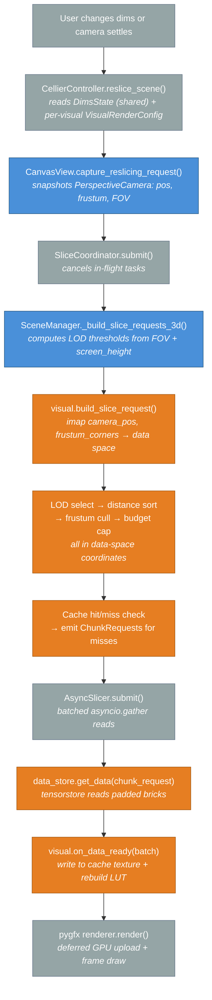
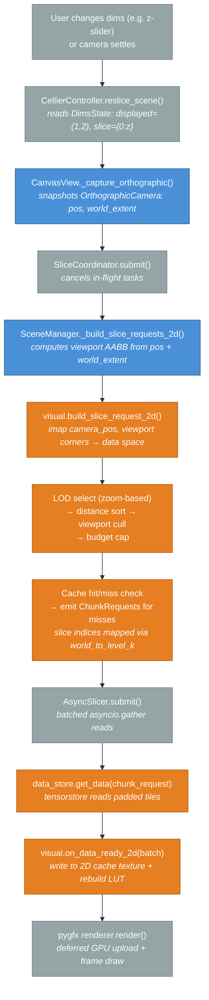
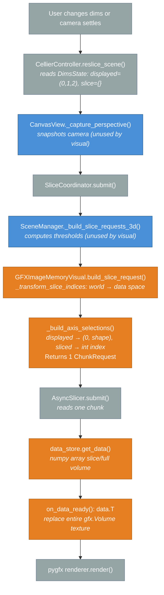
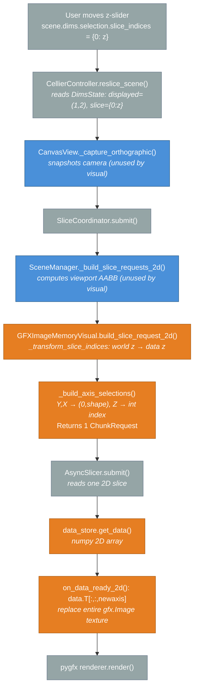

# Cellier v2: Dims Selection and Slicing Pipeline

## 1. Overview

The cellier v2 dims and slicing system converts a user's dimension selection — which axes to display and where to slice — into data loaded onto the GPU. It is a multi-stage pipeline that flows from the model layer (pure state), through the controller (orchestration), into the render layer (GPU resources), and finally to asynchronous I/O.

### Goals

- **nD generality**: Support arbitrary-dimensional data (3D, 4D, 5D…). The `displayed_axes` tuple determines which axes are rendered (2 axes → 2D scene, 3 axes → 3D scene). Non-displayed axes are sliced at a single integer index.
- **Synchronous planning, async I/O**: LOD selection, frustum culling, and chunk planning run synchronously on the main thread (target < 10 ms). Only data reads from disk/network are async.
- **Camera responsiveness**: Camera movement is always free. In-flight data loads are cancelled and resubmitted when the camera settles or a new reslice is requested.
- **Single source of truth**: `DimsManager.selection.displayed_axes` is the single source of truth for render dimensionality. There is no separate `active_dim` field.
- **Immutable data transfer**: All cross-layer data (`DimsState`, `ReslicingRequest`, `ChunkRequest`) are frozen `NamedTuple`s or frozen dataclasses. No component outside the model can mutate state.
- **Layer isolation**: The model layer never imports from the render layer; the render layer never imports from the model layer. All cross-layer communication flows through the controller and typed events.

### Key Assumptions and Constraints

- Data axes are always in **numpy order** (e.g. `z, y, x` for 3D). pygfx/WGSL expects the reversed order (`x, y, z`). The `.T` transpose happens at the GPU commit boundary.
- Each `ChunkRequest` carries an `axis_selections` tuple: one entry per data axis, where displayed axes get `(start, stop)` ranges and non-displayed axes get a single `int` slice index.
- The `AffineTransform` system converts between world-space and data-space coordinates. Slice indices are specified in world space and inverse-transformed to data space before planning.
- `SceneManager.dim` (set at construction) determines whether the 2D or 3D planning path is used. It does not change at runtime.

---

## 2. Similarities and Differences: 2D vs 3D Slicing

### What is shared across all four pipelines

Every pipeline — regardless of 2D/3D and multiscale/in-memory — follows the same high-level stages:

1. **Controller entry**: `CellierController.reslice_scene()` reads `DimsManager` → `DimsState` (shared by all visuals in the scene) and each visual's `ImageAppearance` → a per-visual `VisualRenderConfig`.
   (`src/cellier/v2/controller.py`)
2. **Camera snapshot**: `CanvasView.capture_reslicing_request()` freezes the current camera state into an immutable `ReslicingRequest`.
   (`src/cellier/v2/render/canvas_view.py`)
3. **Coordinator dispatch**: `SliceCoordinator.submit()` cancels in-flight tasks and calls the synchronous planning phase.
   (`src/cellier/v2/render/slice_coordinator.py`)
4. **Planning**: `SceneManager.build_slice_requests()` dispatches to the 2D or 3D path, which calls `visual.build_slice_request[_2d]()`.
   (`src/cellier/v2/render/scene_manager.py`)
5. **Async I/O**: `AsyncSlicer.submit()` reads chunks via `asyncio.gather` in batches.
   (`src/cellier/v2/slicer.py`)
6. **GPU commit**: `visual.on_data_ready[_2d]()` writes data to the GPU.
7. **Render**: pygfx deferred upload flushes dirty textures on the next `renderer.render()` call.

### How 2D and 3D differ (multiscale case)

| Aspect | 3D Multiscale | 2D Multiscale |
|---|---|---|
| Camera type | `PerspectiveCamera` | `OrthographicCamera` |
| Camera controller | `OrbitController` | `PanZoomController` |
| LOD selection | Distance-based thresholds from FOV and screen height | Zoom-based (pixels-per-world-unit) |
| Culling | Frustum planes (6 half-space planes from corners) | Viewport AABB (2D bounding box) |
| Spatial unit | Brick (3D block: `gz, gy, gx`) | Tile (2D block: `gy, gx`) |
| GPU cache | `BrickCache3D` (3D texture + LUT) | `BrickCache2D` (2D texture + LUT) |
| pygfx node | Custom WGSL raycaster `Volume` (`node_3d`) | Image node (`node_2d`) |
| Slice indices | `slice_indices = {}` (all axes displayed) | `slice_indices = {0: z_value}` (one axis sliced) |

### Multiscale vs in-memory image

| Aspect | Multiscale (`GFXMultiscaleImageVisual`) | In-memory (`GFXImageMemoryVisual`) |
|---|---|---|
| Data store | `MultiscaleZarrDataStore` (zarr, tensorstore) | `ImageMemoryStore` (numpy array) |
| LOD levels | Multiple (from zarr pyramid) | Always 1 |
| LOD selection | Yes (distance/zoom based) | No |
| Frustum/viewport culling | Yes | No |
| Brick/tile cache | GPU texture cache with LUT indirection | No cache; full texture replaced each commit |
| Planning output | Potentially hundreds of `ChunkRequest`s (cache misses only) | Always exactly 1 `ChunkRequest` |
| Transform handling | Per-level composed `world_to_level_k` transform | Single `imap_coordinates` on slice indices |
| `on_data_ready` | Writes bricks into cache slots, rebuilds LUT | Replaces entire pygfx texture and geometry |

---

## 3. The 3D Multiscale Image Pipeline

This is the most complex pipeline. It is used when a `GFXMultiscaleImageVisual` is registered in a 3D `SceneManager`.

### Steps

1. **Trigger**: Developer calls `controller.reslice_scene(scene_id)`, or the camera settles after movement.
   (`src/cellier/v2/controller.py` — `reslice_scene()`, `_settle_after()`)

2. **DimsState snapshot**: The controller reads `scene.dims.to_state()` producing an immutable `DimsState` containing `axis_labels` (e.g. `("z","y","x")`) and an `AxisAlignedSelectionState` with `displayed_axes=(0,1,2)` and `slice_indices={}`.
   (`src/cellier/v2/scene/dims.py` — `DimsManager.to_state()`)

3. **VisualRenderConfig (per-visual)**: The controller calls `_build_visual_configs_for_scene()`, which iterates every visual in the scene and reads each visual's own `appearance.lod_bias`, `force_level`, `frustum_cull` into a separate `VisualRenderConfig`. The result is a `dict[UUID, VisualRenderConfig]` keyed by `visual_id`. This means two visuals in the same scene can have independent LOD bias, force level, and culling settings. Non-`MultiscaleImageVisual` types (e.g. `GFXImageMemoryVisual`) are not included in the dict and fall back to `VisualRenderConfig()` defaults, which is fine because they ignore these parameters.
   (`src/cellier/v2/controller.py` — `_build_visual_configs_for_scene()`)

4. **Camera snapshot**: `RenderManager.reslice_scene()` finds the `CanvasView` for the scene and calls `capture_reslicing_request(dims_state)`. This snapshots the `PerspectiveCamera`'s world position, frustum corners `(2,4,3)`, FOV, and screen size into a frozen `ReslicingRequest`.
   (`src/cellier/v2/render/render_manager.py` — `reslice_scene()`)
   (`src/cellier/v2/render/canvas_view.py` — `_capture_perspective()`)

5. **Cancel previous tasks**: `SliceCoordinator.submit()` cancels any in-flight `AsyncSlicer` task for each affected `(scene_id, visual_id)` pair.
   (`src/cellier/v2/render/slice_coordinator.py` — `submit()`)

6. **LOD threshold computation (per-visual)**: `SceneManager._build_slice_requests_3d()` loops over each visual and computes distance thresholds using that visual's `cfg.lod_bias`: `threshold_k = 2^(k-1) × focal_half_height × lod_bias`, where `focal_half_height = (screen_height/2) / tan(fov/2)`. This means two visuals in the same scene can have different LOD behavior.
   (`src/cellier/v2/render/scene_manager.py` — `_compute_thresholds_3d()`)

7. **Visual planning** — `GFXMultiscaleImageVisual.build_slice_request()`:
   - Inverse-transforms `camera_pos_world` and `frustum_corners_world` from world space to data space via `AffineTransform.imap_coordinates()`.
   - Converts data-space frustum corners to 6 inward half-space planes via `frustum_planes_from_corners()`.
   - **LOD selection**: Assigns each base-grid brick to a resolution level based on its distance from `camera_pos` vs the thresholds.
   - **Distance sort**: Sorts bricks nearest-first so close bricks load before far bricks.
   - **Frustum cull**: Tests each brick's AABB against the 6 frustum planes; discards bricks entirely outside the frustum.
   - **Budget cap**: Truncates to the GPU cache slot budget.
   - **Cache hit/miss**: Checks the GPU brick cache; emits `ChunkRequest`s only for cache misses.
   - For each `ChunkRequest`, `axis_selections` is built via `_build_axis_selections()` which maps the brick's `(z0,y0,x0,z1,y1,x1)` ranges onto the full nD axis list using the composed `world_to_level_k` transform for slice indices.
   (`src/cellier/v2/render/visuals/_image.py` — `build_slice_request()`, `_build_axis_selections()`)

8. **Async I/O**: `AsyncSlicer` creates an `asyncio.Task` that reads `batch_size` chunks concurrently via `asyncio.gather`, calling `data_store.get_data(chunk_request)`.
   (`src/cellier/v2/slicer.py` — `_run()`)

9. **GPU commit** — `on_data_ready(batch)`: For each `(ChunkRequest, np.ndarray)` pair, writes the brick into the CPU-side cache backing array, calls `texture.update_range()` to mark the dirty region, then rebuilds the LUT indirection texture.
   (`src/cellier/v2/render/visuals/_image.py` — `on_data_ready()`)

10. **Render**: On the next frame, `WgpuRenderer.render()` uploads all dirty texture regions to the GPU. The custom WGSL raycaster shader samples the brick cache via the LUT.

### Flowchart

**Color key**: Blue = world-space coordinates; Orange = data-space coordinates; Grey = coordination/neutral.

---

## 4. The 2D Multiscale Image Pipeline

This is used when a `GFXMultiscaleImageVisual` is registered in a 2D `SceneManager`. The primary difference from the 3D pipeline is that an `OrthographicCamera` replaces the `PerspectiveCamera`, viewport AABB culling replaces frustum culling, and zoom-based LOD selection replaces distance-based selection.

### Steps

1. **Trigger**: Same as 3D — `controller.reslice_scene(scene_id)` or camera settles.
   (`src/cellier/v2/controller.py`)

2. **DimsState snapshot**: `DimsState` has `displayed_axes=(1,2)` (Y, X) and `slice_indices={0: z_value}` for the non-displayed Z axis.
   (`src/cellier/v2/scene/dims.py` — `DimsManager.to_state()`)

3. **VisualRenderConfig (per-visual)**: Same as 3D — each visual gets its own config from `_build_visual_configs_for_scene()`.
   (`src/cellier/v2/controller.py`)

4. **Camera snapshot**: `CanvasView._capture_orthographic()` snapshots the `OrthographicCamera`'s position and computes the actual visible `world_extent` (width, height) accounting for canvas aspect ratio. Frustum corners are zeroed out (not applicable for ortho cameras).
   (`src/cellier/v2/render/canvas_view.py` — `_capture_orthographic()`)

5. **Cancel previous tasks**: Same as 3D.
   (`src/cellier/v2/render/slice_coordinator.py`)

6. **Viewport AABB computation**: `SceneManager._build_slice_requests_2d()` computes a viewport bounding box from camera position and `world_extent`: `view_min = (cx - w/2, cy - h/2)`, `view_max = (cx + w/2, cy + h/2)`.
   (`src/cellier/v2/render/scene_manager.py` — `_build_slice_requests_2d()`)

7. **Visual planning** — `GFXMultiscaleImageVisual.build_slice_request_2d()`:
   - Inverse-transforms `camera_pos_world` to data space via the 2D sub-transform (`transform.set_slice(displayed_axes)`).
   - If culling is enabled, inverse-transforms the viewport corners from world space to data space.
   - **LOD selection**: Zoom-based — chooses the coarsest level where each tile still has sufficient pixel density (`pixels_per_world_unit × level_scale ≥ 1`).
   - **Distance sort**: Sorts tiles by distance from camera position (nearest-first loading priority).
   - **Viewport cull**: 2D AABB overlap test removes tiles entirely outside the viewport.
   - **Budget cap**: Truncates to the GPU tile cache slot budget.
   - **Cache hit/miss**: Checks the 2D tile cache; emits `ChunkRequest`s for misses.
   - For each `ChunkRequest`, `_build_axis_selections()` is called with the composed `world_to_level_k` transform, which maps slice indices (e.g. Z) through the inverse transform to the correct voxel index at that pyramid level.
   (`src/cellier/v2/render/visuals/_image.py` — `build_slice_request_2d()`, `_build_axis_selections()`)

8. **Async I/O**: Same as 3D.
   (`src/cellier/v2/slicer.py`)

9. **GPU commit** — `on_data_ready_2d(batch)`: Writes tiles into the 2D tile cache texture, marks dirty regions, rebuilds the 2D LUT texture.
   (`src/cellier/v2/render/visuals/_image.py` — `on_data_ready_2d()`)

10. **Render**: Same as 3D — deferred GPU upload on next `renderer.render()`.

### Flowchart

**Color key**: Blue = world-space coordinates; Orange = data-space coordinates; Grey = coordination/neutral.

---

## 5. The 3D In-Memory Image Pipeline

This is used when a `GFXImageMemoryVisual` is registered in a 3D `SceneManager`. It is much simpler than the multiscale pipeline because there is no LOD selection, no brick cache, and no frustum culling. Every reslice loads the entire 3D sub-volume in one `ChunkRequest`.

### Steps

1. **Trigger**: Same as multiscale — `controller.reslice_scene(scene_id)` or camera settles.
   (`src/cellier/v2/controller.py`)

2. **DimsState snapshot**: For a 3D scene with 3D data: `displayed_axes=(0,1,2)`, `slice_indices={}`. For 4D+ data in a 3D scene: e.g. `displayed_axes=(1,2,3)`, `slice_indices={0: t_value}`.
   (`src/cellier/v2/scene/dims.py`)

3. **Camera snapshot + coordinator dispatch**: Same as multiscale 3D.
   (`src/cellier/v2/render/canvas_view.py`, `src/cellier/v2/render/slice_coordinator.py`)

4. **SceneManager**: Dispatches to `_build_slice_requests_3d()` which computes thresholds and calls `visual.build_slice_request()`. The visual ignores camera/frustum parameters.
   (`src/cellier/v2/render/scene_manager.py`)

5. **Visual planning** — `GFXImageMemoryVisual.build_slice_request()`:
   - If `dims_state` is `None`, treats all axes as displayed.
   - Otherwise, calls `_transform_slice_indices()` to inverse-transform slice indices from world space to data space (rounding and clamping to valid voxel range).
   - Calls `_build_axis_selections(transformed_dims, store_shape)`: displayed axes get `(0, store_shape[ax])`, sliced axes get their integer index.
   - Returns exactly one `ChunkRequest`.
   (`src/cellier/v2/render/visuals/_image_memory.py` — `build_slice_request()`, `_transform_slice_indices()`, `_build_axis_selections()`)

6. **Async I/O**: `AsyncSlicer` reads the single chunk via `data_store.get_data()`.
   (`src/cellier/v2/slicer.py`)

7. **GPU commit** — `on_data_ready(batch)`: Takes the single `(request, data)` pair. Transposes `data` from numpy `(D,H,W)` to pygfx `(W,H,D)` via `.T`. Replaces the entire `gfx.Volume` geometry with a new `gfx.Texture`.
   (`src/cellier/v2/render/visuals/_image_memory.py` — `on_data_ready()`)

8. **Render**: Deferred GPU upload on next frame.

### Flowchart

**Color key**: Blue = world-space coordinates; Orange = data-space coordinates; Grey = coordination/neutral.

---

## 6. The 2D In-Memory Image Pipeline

This is used when a `GFXImageMemoryVisual` is registered in a 2D `SceneManager`. Like the 3D in-memory case, it produces exactly one `ChunkRequest` with no LOD or culling.

### Steps

1. **Trigger**: User changes the z-slider (writing `scene.dims.selection.slice_indices = {0: z_value}`), then calls `controller.reslice_scene(scene_id)`.
   (`src/cellier/v2/controller.py`)

2. **DimsState snapshot**: `displayed_axes=(1,2)` (Y, X) and `slice_indices={0: z_value}`.
   (`src/cellier/v2/scene/dims.py`)

3. **Camera snapshot**: `CanvasView._capture_orthographic()` snapshots the `OrthographicCamera`. The camera parameters are unused by the visual but required for the `ReslicingRequest` structure.
   (`src/cellier/v2/render/canvas_view.py`)

4. **Coordinator dispatch**: Same as other pipelines.
   (`src/cellier/v2/render/slice_coordinator.py`)

5. **SceneManager**: Dispatches to `_build_slice_requests_2d()` which computes a viewport AABB and calls `visual.build_slice_request_2d()`. The visual ignores all camera/viewport parameters.
   (`src/cellier/v2/render/scene_manager.py`)

6. **Visual planning** — `GFXImageMemoryVisual.build_slice_request_2d()`:
   - Calls `_transform_slice_indices()` to inverse-transform the world-space `slice_indices` to data-space voxel indices via `AffineTransform.imap_coordinates()`.
   - Calls `_build_axis_selections()`: displayed axes (Y, X) get `(0, store_shape[ax])`, sliced axis (Z) gets the integer index.
   - Returns exactly one `ChunkRequest` with `scale_index=0`.
   (`src/cellier/v2/render/visuals/_image_memory.py` — `build_slice_request_2d()`, `_transform_slice_indices()`, `_build_axis_selections()`)

7. **Async I/O**: `AsyncSlicer` reads the single 2D slice.
   (`src/cellier/v2/slicer.py`)

8. **GPU commit** — `on_data_ready_2d(batch)`: Takes the `(request, data)` pair. Transposes from numpy `(H,W)` to pygfx `(W,H,1)` via `.T[:,:,np.newaxis]`. Replaces the entire `gfx.Image` geometry with a new `gfx.Texture`.
   (`src/cellier/v2/render/visuals/_image_memory.py` — `on_data_ready_2d()`)

9. **Render**: Deferred GPU upload on next frame.

### Flowchart

**Color key**: Blue = world-space coordinates; Orange = data-space coordinates; Grey = coordination/neutral.

---

## Appendix: Key File Reference

| Component | Path |
|---|---|
| `DimsManager`, `AxisAlignedSelection`, `CoordinateSystem` | `src/cellier/v2/scene/dims.py` |
| `DimsState`, `AxisAlignedSelectionState`, `CameraState` | `src/cellier/v2/_state.py` |
| `CellierController` | `src/cellier/v2/controller.py` |
| `RenderManager` | `src/cellier/v2/render/render_manager.py` |
| `SceneManager` | `src/cellier/v2/render/scene_manager.py` |
| `CanvasView` | `src/cellier/v2/render/canvas_view.py` |
| `SliceCoordinator` | `src/cellier/v2/render/slice_coordinator.py` |
| `AsyncSlicer` | `src/cellier/v2/slicer.py` |
| `ReslicingRequest` | `src/cellier/v2/render/_requests.py` |
| `VisualRenderConfig` | `src/cellier/v2/render/_scene_config.py` |
| `GFXMultiscaleImageVisual` | `src/cellier/v2/render/visuals/_image.py` |
| `GFXImageMemoryVisual` | `src/cellier/v2/render/visuals/_image_memory.py` |
| `MultiscaleZarrDataStore` | `src/cellier/v2/data/image.py` |
| `ImageMemoryStore` | `src/cellier/v2/data/image/_image_memory_store.py` |
| `AffineTransform` | `src/cellier/v2/transform.py` |
| Integration example | `scripts/v2/integration_2d_3d/example_combined_camera_redraw.py` |
