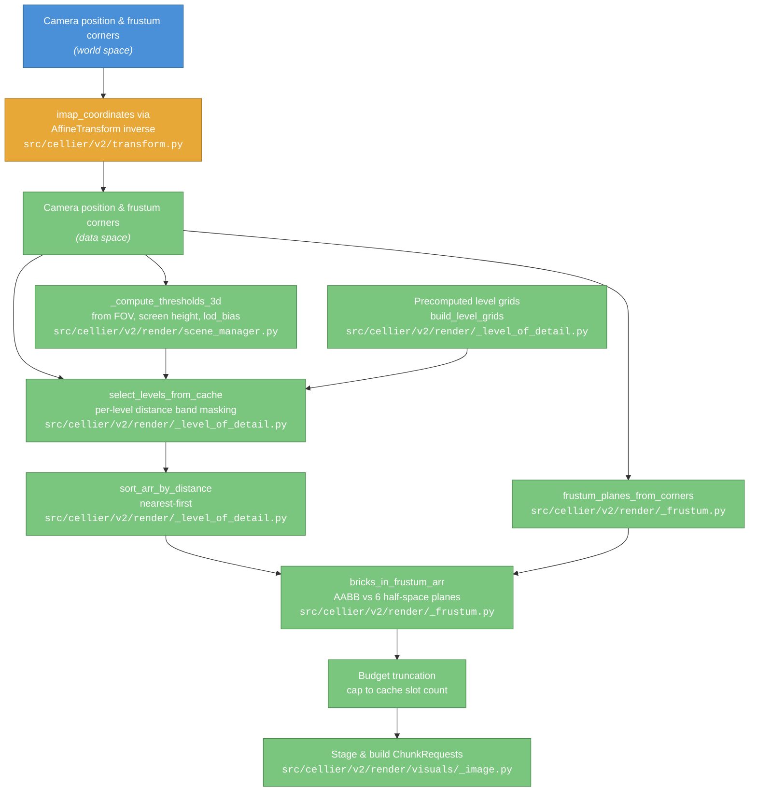
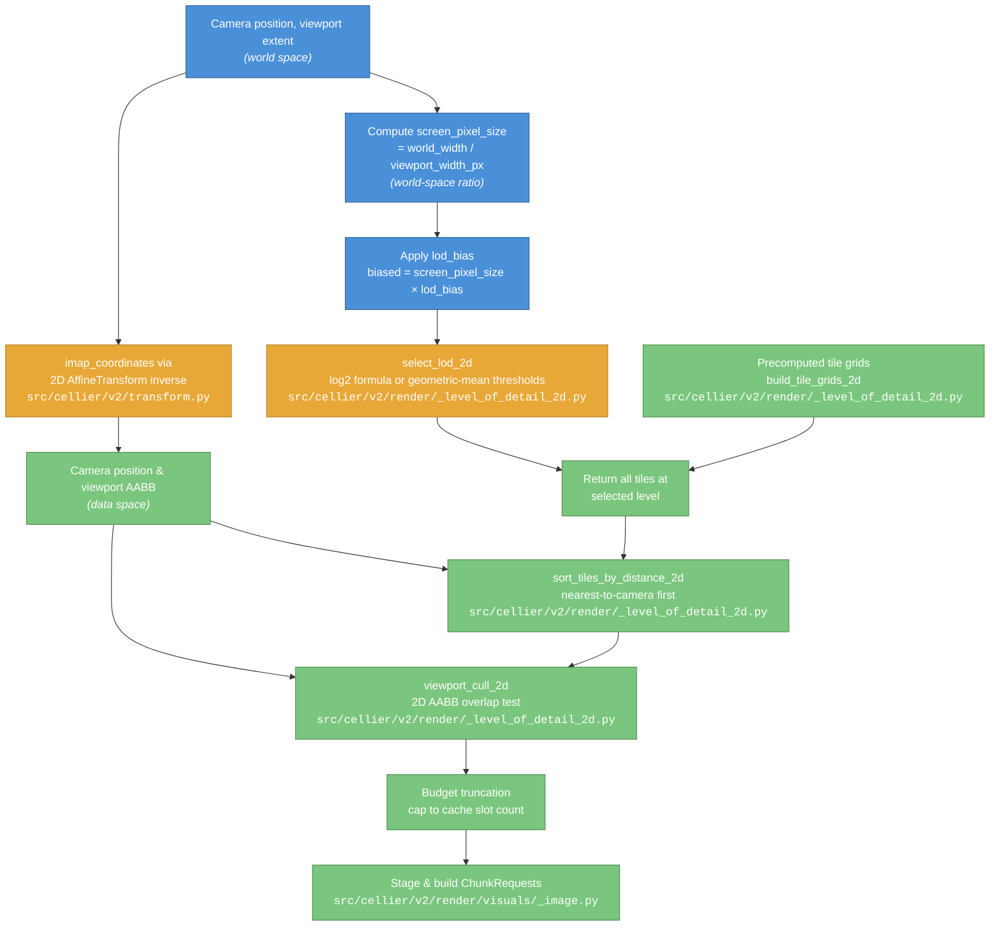

# Cellier v2 — Level of Detail Selection Pipeline

## Overall Goal

The level of detail (LOD) selection pipeline determines which resolution level of a multiscale dataset to load for each spatial region of the viewer. Scientific datasets stored as multiscale pyramids (e.g., OME-NGFF zarr) contain the same data at progressively coarser resolutions — level 1 is the finest (original), level 2 is downsampled, and so on. Loading the entire dataset at full resolution would exceed GPU memory and be wasteful when pixels are too small to resolve individual voxels.

The LOD pipeline solves this by choosing the coarsest resolution level that still provides sufficient visual quality for the current camera state. It then tiles the selected data into fixed-size blocks (bricks in 3D, tiles in 2D), sorts them by priority, culls off-screen blocks, and caps the total to the GPU memory budget. The output is a list of `ChunkRequest` objects that the async I/O system fetches from zarr stores and uploads to the GPU brick cache.

Cellier v2 implements two distinct LOD pipelines — one for 3D volume rendering (perspective camera, distance-based per-brick selection) and one for 2D tiled image rendering (orthographic camera, zoom-based global selection). Both share the same downstream stages: distance sort, spatial culling, budget truncation, and cache staging.

---

## 3D Pipeline — Distance-Based Per-Brick LOD Selection

### Criteria

Each brick is assigned a resolution level based on the **Euclidean distance from the camera to the brick's center** in data space. Bricks close to the camera are assigned the finest level; bricks far away are assigned coarser levels. This exploits the perspective projection property that distant objects subtend fewer screen pixels, so coarser data is visually indistinguishable from fine data at those distances.

### How It Works

The 3D planning pipeline is orchestrated by `SceneManager._build_slice_requests_3d()` (`src/cellier/v2/render/scene_manager.py`), which calls `GFXMultiscaleImageVisual.build_slice_request()` (`src/cellier/v2/render/visuals/_image.py`) for each visual.

The pipeline operates in two phases — a one-time startup precomputation and a per-frame hot path.

**Startup — `build_level_grids()`** (`src/cellier/v2/render/_level_of_detail.py`): For each LOD level k, the function precomputes the coarse brick grid (grid dimensions, integer grid indices, and world-space brick centres). For level k, each coarse brick covers `2^(k-1)` base-level bricks along each axis. When arbitrary (non-power-of-2) level shapes are provided, grid dimensions are derived from actual per-level voxel counts and per-level affine scale/translation vectors position the centres in world space. These arrays are computed once and cached — the hot path never allocates new coordinate arrays.

**Per-frame hot path — `select_levels_from_cache()`** (`src/cellier/v2/render/_level_of_detail.py`): The pipeline receives the camera position (transformed from world to data space via `AffineTransform.imap_coordinates()` in `src/cellier/v2/transform.py`) and a list of distance thresholds. For each level k, it computes the Euclidean distance from the camera to every precomputed brick centre in that level's coarse grid, then applies a boolean mask selecting only the bricks whose distance falls within level k's distance band:

- Level 1 (finest): distance < threshold[0]
- Level k (intermediate): threshold[k-2] ≤ distance < threshold[k-1]
- Level N (coarsest): distance ≥ threshold[N-2]

Because the bands partition the entire distance axis without overlap, no brick can appear in more than one level and no deduplication is needed. The surviving brick arrays from all levels are concatenated into a single `(M, 4)` array of `[level, gz, gy, gx]` rows.

When a forced level is specified, `select_levels_arr_forced()` (`src/cellier/v2/render/_level_of_detail.py`) returns the full coarse grid for that single level, bypassing distance computation.

**Threshold computation — `_compute_thresholds_3d()`** (`src/cellier/v2/render/scene_manager.py`): The `SceneManager` computes thresholds from the perspective camera's field of view and screen height:

```
focal_half_height = (screen_height_px / 2) / tan(fov_y / 2)
threshold_k = 2^(k-1) × focal_half_height × lod_bias
```

This produces the distance at which a single voxel at level k subtends approximately one screen pixel. The `lod_bias` parameter scales all thresholds uniformly.

If no camera parameters are available, a fallback computes thresholds from the volume diagonal: `threshold[i] = diagonal × (i + 1)`.

**Subsequent stages** (inside `GFXMultiscaleImageVisual.build_slice_request()` in `src/cellier/v2/render/visuals/_image.py`):

1. **Distance sort** — `sort_arr_by_distance()` (`src/cellier/v2/render/_level_of_detail.py`) sorts bricks nearest-to-camera first so that the most visually important data loads first.
2. **Frustum culling** — World-space frustum corners are transformed to data space via `AffineTransform.imap_coordinates()` (`src/cellier/v2/transform.py`), then converted to 6 inward-pointing half-space planes by `frustum_planes_from_corners()` (`src/cellier/v2/render/_frustum.py`). Then `bricks_in_frustum_arr()` (`src/cellier/v2/render/_frustum.py`) tests each brick's 8 AABB corners against all planes using a vectorised einsum: a brick is visible if, for every plane, at least one corner has non-negative signed distance. This is a conservative test (never culls visible bricks, may retain a few just-outside bricks).
3. **Budget truncation** — If the number of remaining bricks exceeds the cache slot count, the farthest bricks (already sorted to the end) are dropped.
4. **Stage** — The tile manager checks which bricks are already cached (hits) and allocates slots for new bricks (misses), producing a fill plan.

### User Adjustment

Users can bias LOD selection toward finer or coarser levels through two mechanisms:

- **`lod_bias`** (float, default 1.0): A multiplicative factor on all distance thresholds. Values > 1.0 push thresholds outward, causing the system to switch to coarser levels later (more detail, more bricks needed). Values < 1.0 pull thresholds inward, switching to coarser levels sooner (less detail, fewer bricks). Exposed as a `QDoubleSpinBox` in the example GUI.
- **`force_level`** (int or None): When set, bypasses LOD selection entirely and assigns every brick to the specified level. Useful for debugging. Exposed as radio buttons (Auto / 1 / 2 / 3) in the example GUI.
- **`frustum_cull`** (bool): Enables or disables frustum culling. Disabling it loads all bricks regardless of visibility.

### 3D Flow Diagram



---

## 2D Pipeline — Zoom-Based Global LOD Selection

### Criteria

All tiles are assigned the **same resolution level**, determined by the ratio of screen pixel size to data pixel size. In an orthographic 2D view, all tiles are at the same effective "distance" from the camera, so there is no spatial variation in required resolution — a single global LOD level suffices.

### How It Works

The 2D planning pipeline is orchestrated by `SceneManager._build_slice_requests_2d()` (`src/cellier/v2/render/scene_manager.py`), which calls `GFXMultiscaleImageVisual.build_slice_request_2d()` (`src/cellier/v2/render/visuals/_image.py`) for each visual.

**Startup — `build_tile_grids_2d()`** (`src/cellier/v2/render/_level_of_detail_2d.py`): Identical in structure to the 3D case but for 2D grids. For each level k, the function precomputes the coarse tile grid indices and world-space tile centres (incorporating per-level scale and translation vectors when provided). These are cached for the hot path.

**Per-frame hot path — `select_lod_2d()`** (`src/cellier/v2/render/_level_of_detail_2d.py`): The function receives the viewport width in pixels and the visible world width in world units, then computes the screen pixel size:

```
screen_pixel_size = world_width / viewport_width_px
```

This is the number of world units per screen pixel. At level 1 (finest), each data pixel occupies 1 world unit. At level k, each data pixel occupies `scale_factor[k]` world units.

**When arbitrary scale factors are available** (non-power-of-2 multiscale data), the function searches over the actual per-level scale factors. The transition threshold between consecutive levels is placed at the geometric mean of their scale factors:

```
threshold_k = sqrt(scale_factor[k] × scale_factor[k+1])
```

If the biased screen pixel size exceeds the threshold, the next coarser level is selected.

**Power-of-2 fallback**: When no explicit scale factors are provided, the continuous LOD level is computed via the classic mipmapping formula:

```
ideal_level = 1 + log2(screen_pixel_size × lod_bias)
```

This is rounded to the nearest integer and clamped to `[1, n_levels]`. The correspondence is:

- `screen_pixel_size = 1.0` → ideal = 1.0 (1:1 mapping, use level 1)
- `screen_pixel_size = 2.0` → ideal = 2.0 (each screen pixel covers 2 data pixels, use level 2)
- `screen_pixel_size = 4.0` → ideal = 3.0 (each screen pixel covers 4 data pixels, use level 3)

All tiles at the selected level are returned as `[level, gy, gx]` rows.

**Subsequent stages** (inside `GFXMultiscaleImageVisual.build_slice_request_2d()` in `src/cellier/v2/render/visuals/_image.py`):

1. **Coordinate transform** — Camera position and viewport AABB corners are transformed from world to data space via the 2D sub-transform (`AffineTransform.set_slice()` / `imap_coordinates()` in `src/cellier/v2/transform.py`).
2. **Distance sort** — `sort_tiles_by_distance_2d()` (`src/cellier/v2/render/_level_of_detail_2d.py`) sorts tiles by Euclidean distance from the camera centre (nearest first) so the most visually central tiles load first.
3. **Viewport culling** — `viewport_cull_2d()` (`src/cellier/v2/render/_level_of_detail_2d.py`) performs a 2D AABB overlap test that removes tiles lying entirely outside the viewport rectangle. For each tile, its data-space bounding box is computed from its grid index and level scale/translation, then tested for overlap with the viewport AABB (also in data space).
4. **Budget truncation** — Remaining tiles are capped to the 2D cache slot count.
5. **Stage** — The 2D tile manager checks cache hits and allocates slots for misses.

### User Adjustment

The same two user-facing controls are available for 2D:

- **`lod_bias`** (float, default 1.0): A multiplicative factor on the screen pixel size. Values > 1.0 make the screen pixel appear larger than it really is, pushing selection toward coarser levels (less detail, fewer tiles). Values < 1.0 make it appear smaller, favoring finer levels (more detail, more tiles). Doubling the bias shifts every level transition by exactly one full LOD level.
- **`force_level`** (int or None): Bypasses zoom-based selection entirely and assigns all tiles to the specified level.
- **Viewport culling toggle** (`use_culling` / `frustum_cull`): Enables or disables viewport AABB culling.

### 2D Flow Diagram



---

## Function Reference

| Function | File Path |
|----------|-----------|
| `build_level_grids()` | `src/cellier/v2/render/_level_of_detail.py` |
| `select_levels_from_cache()` | `src/cellier/v2/render/_level_of_detail.py` |
| `select_levels_arr_forced()` | `src/cellier/v2/render/_level_of_detail.py` |
| `sort_arr_by_distance()` | `src/cellier/v2/render/_level_of_detail.py` |
| `arr_to_brick_keys()` | `src/cellier/v2/render/_level_of_detail.py` |
| `build_tile_grids_2d()` | `src/cellier/v2/render/_level_of_detail_2d.py` |
| `select_lod_2d()` | `src/cellier/v2/render/_level_of_detail_2d.py` |
| `sort_tiles_by_distance_2d()` | `src/cellier/v2/render/_level_of_detail_2d.py` |
| `viewport_cull_2d()` | `src/cellier/v2/render/_level_of_detail_2d.py` |
| `arr_to_block_keys_2d()` | `src/cellier/v2/render/_level_of_detail_2d.py` |
| `frustum_planes_from_corners()` | `src/cellier/v2/render/_frustum.py` |
| `bricks_in_frustum_arr()` | `src/cellier/v2/render/_frustum.py` |
| `_compute_thresholds_3d()` | `src/cellier/v2/render/scene_manager.py` |
| `_build_slice_requests_3d()` | `src/cellier/v2/render/scene_manager.py` |
| `_build_slice_requests_2d()` | `src/cellier/v2/render/scene_manager.py` |
| `GFXMultiscaleImageVisual.build_slice_request()` | `src/cellier/v2/render/visuals/_image.py` |
| `GFXMultiscaleImageVisual.build_slice_request_2d()` | `src/cellier/v2/render/visuals/_image.py` |
| `AffineTransform.imap_coordinates()` | `src/cellier/v2/transform.py` |
| `AffineTransform.set_slice()` | `src/cellier/v2/transform.py` |
